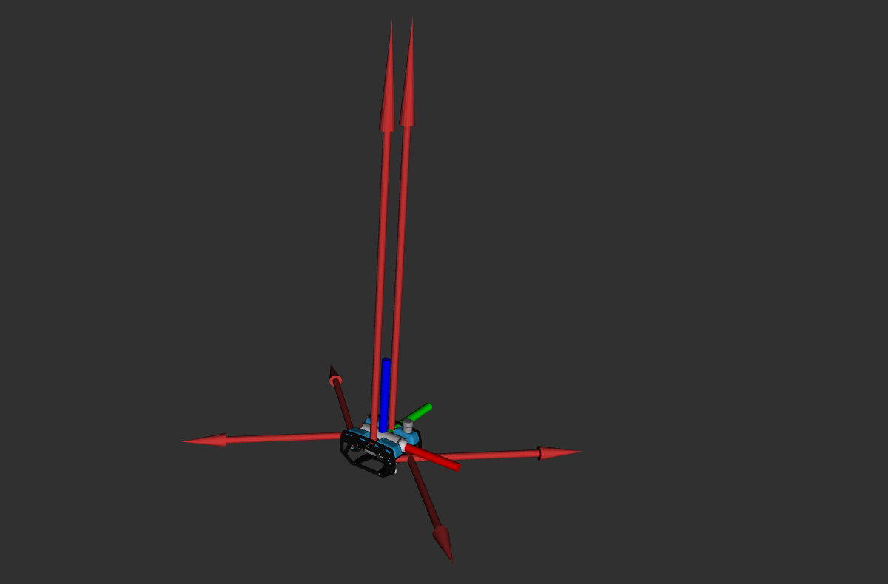

# A thruster manager package for underwater vehicles

This packages instanciates a thruster manager node that maps desired wrench to propeller thrusts for a given vehicle model. It relies on Eigen for the linear algebra computation.

The node assumes that the model is a URDF found on the local `robot_description` topic (published by `robot_state_publisher`).

## How to run

The node can be used in several ways:

- as an independant node `ros2 run thruster_manager thruster_manager_node`
- as a component `thruster_manager/thruster_manager::ThrusterManagerNode`
- as a non-node class `thruster_manager::ThrusterManager` that can be instanciated from your custom node

## Parameters

Parameters are three-fold, some of them are always declared (`thruster_manager::ThrusterManager`) as they are needed by the core algorithm, others are about input/output and are only declared in the node instances.

### Main control frame

The desired wrench is assumed to be given in some control frame of the robot, it is tunable with the `control_frame` parameter (default `base_link`). The thruster allocation matrix is computed with regards to this frame.

### Identify the thrusters

The mapping between body wrench and propeller thrust needs to identify which joints are to be considered as thrusters. They are three complementary ways to do so:

- `tam.thrusters` (`array[string]`): will use all the joint names listed in this parameter
- `tam.thruster_prefix` (`string`): will use all joints that begins with the prefix
- `tam.use_gz_plugin` (`bool`, default `True`)): will use all joints that have a `gazebo::systems::Thruster` plugin in the URDF
- `tam.use_tf` (`bool`, default `False`): will recompute the allocation matrix from TF. This is useful for a ROV with steering thrusters

If no hint is given (default) then the parser will assume all revolute and continuous joints of the model are thrusters.

### Thrust constraints

These constraints assume all thrusters have the same properties

- `tam.min_thrust` (default 0.): minimum, negative thrust
- `tam.max_thrust` (default 0.): maximum, positive thrust
- `tam.deadzone` (default 0.): positive value to try and avoid in the allocation
- `tam.continuity` (default 0.1): weight on sign continuity for thrusts, in case of vectored thrusters

If both `min` and `max` thrusts are given then the overall thrusts are scaled down to fit in the constraints.

If the deadzone is given *and* the allocation matrix has a non-null kernel then a basic iterative algorithm will try to apply the desired wrench while avoiding thrusts between `[-deadzone, +deadzone]`, according to the following article:

`Ropars, Benoit, et al. "Thruster's dead-zones compensation for the actuation system of an underwater vehicle." 2015 European Control Conference (ECC). IEEE, 2015.`.

This behavior is illustrated in the figure below where a BlueROV2 is standing still while its 4 horizontal thrusters apply non-null forces.

### Input / output (ThrusterManagerNode only)

- `publish_joint_state` (default `true`): will publish the output as a `JointState` message on `cmd_thrust`. Only the `effort` field is used.
- `publish_gz_command` (default `false`): will publish the output as several `Float64` messages on each `cmd_<thruster_name>` topics. This is the expected behavior for Gazebo thrust plugin.
- `subscribe_stamped` (default `false`): will expect `WrenchStamped` messages intead of `Wrench`, in any case the node will subscribe to the `wrench` topic.

## Using the `ThrusterManager` class outside this package

The `ThrusterManager` class can be used as-is outside the package, typically from a control node that computes some desired wrench and directly solves the allocation without relying on the external `ThrusterManagerNode`.

The class required no parameters to be instanciated. Then, two functions may be used to initialize the allocation matrix:

- `parseRobotDescription(rclcpp::Node *node, const std::string &control_frame)`
    - declares all `tam.*` parameters for the given `*node`
- `std::vector<std::string> parseRobotDescription(rclcpp::Node *node, const std::string &control_frame, const std::vector<std::string> &thrusters, const std::string &thruster_prefix, bool use_gz_plugin)`
    - initializes the allocation based on the given thruster identification parameters, does not declare any `tam.*` parameters
    - thruster limits can be set through `setThrusterLimits(double fmin, double fmax, double deadzone)`

The two `parseRobotDescription` methods return the names of the thruster joints, it can be used to initialize the publishers to the simulation or the real thrusters.

The core method is `Eigen::VectorXd solveWrench(const Vector6d &wrench)` that finds the overall thruts (return value) from the desired wrench.

Controllers can also use the `maxWrench()` function to use it in anti-windup approaches, if any. This method returns a `Eigen::Vector` of dimension 6 with the maximum wrench on all components : x, y, z, roll, pitch, yaw.

## Publish_wrenches

The `publish_wrenches` node will subscribe to thrusts published by a `ThrusterManager` instance and forward them as actual `Wrench` that can be displayed in RViz, if needed.
